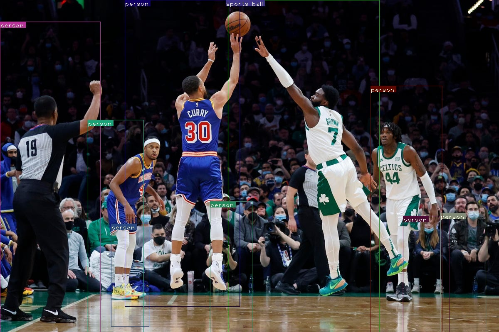

# YOLOv3 Object Detector Implemented in PyTorch

This is an application I made for self-learning so that I can better understand the working of the YOLO alorithms.<br>

At the time of making this repo there are already more advanced versions of Yolo.<br>

I am starting with the simpler YOLOv3 network and will then work up to the more complex versions of the YOLO network like Yolov5, Yolov7 etc.<br>

<b>The official version of Yolov3 was implemented in C</b>

<br>

## Setup the Application

### Install the Requirements file
```
pip install -r requirements.txt
```

### Download the Weights
- Download the weights file from this [link](https://pjreddie.com/media/files/yolov3.weights)
- Store the file in the parent directory

## Running the Application

### To run the file on a single image
```
python detect.py --images {INPUT_FILE_PATH} --det {OUTPUT_IMAGE_DIRECTORY}
```
